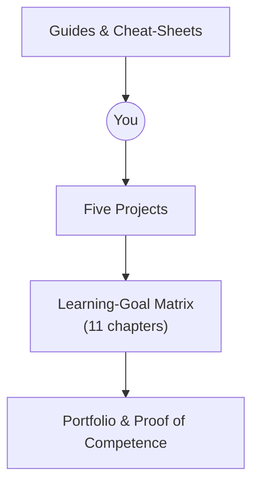

# How to *Vibecode* — Learning Guide v0.1  
*A companion to the "AI‑First Development" starter pack*  

---

## 0  Why This Guide Exists  

The repo you just cloned is **not** a linear tutorial.  
It is a *toolbox* plus five progressively harder projects that push you to orchestrate AI coding agents, ship real software, and reflect on what you learn. 

This learning approach allows you to build proofs of competence, rather than collecting credentials. By deploying the software you will be building, documenting your learning, and sharing your journey and developing expertise online, you will create an extensive portfolio. This can be used to impress potential employers and build confidence in your ability to complete full projects, which might even lead to founding your own startup.

This guide shows you **how to work inside the vibecoding sandbox** of proven tools, frameworks, and workflows, so you can squeeze the most learning‑per‑hour out of every stumble, refactor and deploy.

> **TL;DR** — For each project, read the PRD, slice it into phases, generate checklists, let the agent build, test & deploy early, document the learning goals you actually hit, and keep vibing forward.

---

## 1  The Course in One Picture  



* **Guides** – `guides/workflow_o3.md`, `guides/tools_synthesized.md`, this file.  
* **Projects** – 01 PromptLibrary → 05 VidTutor.  
* **Learning Goals** – `goals/learning_goals.md` (11 themed chapters).  
* **Outputs** – running apps, PRDs, blog/video reflections, GitHub repos.

---

## 2  Core Principles  

| Principle                  | What It Means in Practice                                                                                  |
| -------------------------- | ---------------------------------------------------------------------------------------------------------- |
| **AI‑First**               | Treat Replit Agent, Cursor, Windsurf, Claude Code, etc. as junior devs you orchestrate.                    |
| **Learning By Shipping**   | "It runs in prod" beats perfect test coverage.                                                             |
| **Checklists > Specs**     | LLMs execute atomic tasks better than vague paragraphs. Use reasoning models to build plans and checklists |
| **Fail → Debug → Explain** | Every red error is a learning goal fossil—dig it up, write it down, move on.                               |
| **Document The Journey**   | `.md` notes, demo videos, tweets, repos: your future job interview ammo.                                   |

---

## 3  The Vibecoding Loop  

1. **Absorb the PRD**  
   *Skim the vision, user stories & cut‑lines.*  
2. **Phase the Work**  
   Split the PRD into 2‑to‑4 hour "mini‑milestones" (UI scaffold, DB schema, auth, etc.).  
3. **Checklist It**  
   Drop a *Planning Prompt* into your agent:  
```

Create a 10‑item checklist (no code) to finish ⭐ [phase]⭐.

```
4. **Agentic Execution**  
Let the agent tackle each unchecked box. Intervene, test, commit.  
5. **Deploy Early**  
Replit "Deploy", Vercel Preview, Firebase Hosting—whatever ships fastest.  
6. **Reflect & Map**  
After each milestone open `learning_goals.md` and mark which bullets you *actually* touched. Jot a quick note or screenshot.  
7. **Rinse & Repeat**  

```

PRD → Phase → Checklist → Agent → Test/Deploy → Reflect

```

---

## 4  Tooling Cheat‑Sheet (Super Condensed)  

| Need                            | Tool             | 1‑Line Tip                                            |
| ------------------------------- | ---------------- | ----------------------------------------------------- |
| Zero‑to‑CRUD in the browser     | **Replit Agent** | Start Project 01 entirely here.                       |
| Local deep dives & git wizardry | **Cursor IDE**   | Import repo, ask "Explain folder structure."          |
| Semantic codebase edits         | **Windsurf**     | Great for "rename model, update everywhere".          |
| Autonomous terminal hacker      | **Claude Code**  | Run inside Cursor's terminal for observability.       |
| Design‑heavy UI                 | **Vercel v0**    | Prompt "Dashboard with sidebar & dark mode" → export. |
| Postgres + Realtime + Vec       | **Supabase**     | Projects 02 & 03 default backend.                     |
| NoSQL + Edge Functions + Gemini | **Firebase**     | Projects 04 & 05 showcase AI pipelines.               |

👉  Full details live in `guides/tools_synthesized.md`.

---

## 5  From Guided to Open‑Ended  

| Project              | Guidance Level                                    | New Hard Thing                               |
| -------------------- | ------------------------------------------------- | -------------------------------------------- |
| **01 PromptLibrary** | PRD with precise building instructions for Replit | First AI‑assisted CRUD                       |
| **02 PBLab**         | Full PRD, v0 template                             | Relational data & RBAC                       |
| **03 EduPictionary** | Full PRD, no code                                 | Realtime, WebSockets, CRDT                   |
| **04 PodBrain**      | *Scaffold* PRD you must refine                    | RAG, embeddings, audio pipeline              |
| **05 VidTutor**      | Research brief only                               | End‑to‑end AI video generation, IaC, billing |

Expect the hand‑holding to fade—your autonomy should grow to match.

---

## 6  Tracking Your Learning Goals  

1. For at least every learning goal, but better for every hurdle that you hit, create a .md file in the `notes` folder. Ask AI to synthesize research reports into notes if you want, but make sure to read and edit the notes to absorb the information.  
2. Link back to code commits or screenshots that prove you *used* the concept. You can literally use at mentions for the files that contain the code. Create .md links between notes to create a map of your learning.  
3. At the end of a project, compile a `learning_reflection.md` with a table:

| Chapter | Item | Evidence |
|---------|------|----------|
| 6 – Back‑End | **REST** endpoint | commit `abc123`, screenshot |
| 7 – Data | Supabase **schema migration** | PR #17 |

These artifacts become your **portfolio evidence**.

*Note*: I highly recommend viewing this repo and building your notes with *Obsidian*. It will make note-taking and connection-making much more enjoyable. Use the graph view to see your knowledge graph grow.

---

## 7  Deliverables & Proof‑of‑Competence  

| Milestone                  | What To Submit                                                                                                           |
| -------------------------- | --------------------------------------------------------------------------------------------------------------------------------------- |
| End of each project        | • Deployed URL • Repo link • 2-min demo video • `learning_reflection.md` • Social media post                                          |
| End of course (optionally) | Collated portfolio page + "What I learned" blog post                                                                                    |

> **Tip** — Post your demo links on X / LinkedIn; feedback is 10× dopamine for learning.

---

## 8  Community & Support  

* GitHub Issues in this repo → ask, share, propose templates. Submit PRs to improve the guides or add learning goals and projects.
* Discord `#vibecoding-sidequest` (invite in email) → community support and live help sessions.  
* Monthly *Demo Day* (online) → showcase best builds.

---

## 9  FAQ  

**Q: Do I *have* to use Replit / Supabase / Vercel / ... ?**  
A: No. Feel free to swap stacks—just justify the trade‑offs in your PRD.

**Q: I broke everything, the agent made 72 file edits. Now what?**  
A: Hard‑reset to last good commit, regenerate a smaller checklist, and try again. *Small scopes prevent big disasters. Get used to rolling back frequently*

**Q: How much time should I budget?**  
A: This vastly depends on your experience level and ambition of how impressive you want your portfolio to be. Rough heuristic per project:

* **Project 01** – ~4–6 h
* **Projects 02-04** – ~20-100 h each (depends on rabbit holes and which features you want to build)
* **Project 05** – 80 h + (research + build)

Total course: **≈ ~200 h** depending on how deep you dive.
Lite version: Doing projects 01-03, covering 70% of learning goals, you can finish in ~40-60 h.

**Q: Graduation criteria?**  
A: Ship all five MVPs, map ≥ 70 % of learning goals with evidence, and present a demo video montage. Submit your portfolio to the challenge page on sidequests.gg.

---

## 10  Next Steps  

1. **Pick Project 01** → open PRD → fire up Replit Agent.  
2. Create your first CRUD app within the next hour.  
3. Join Discord and say hi 👋.  

Happy *vibecoding* — may your deployments be green and your AI agents obedient!

---
*Last updated: June 12 2025*  

